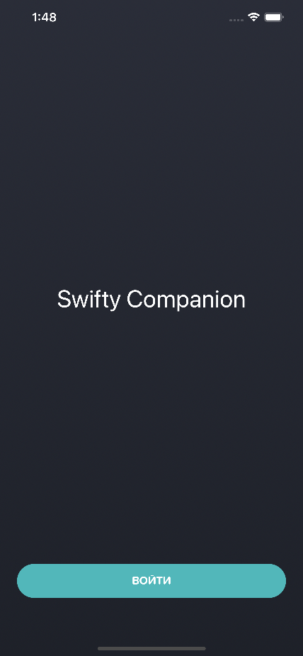
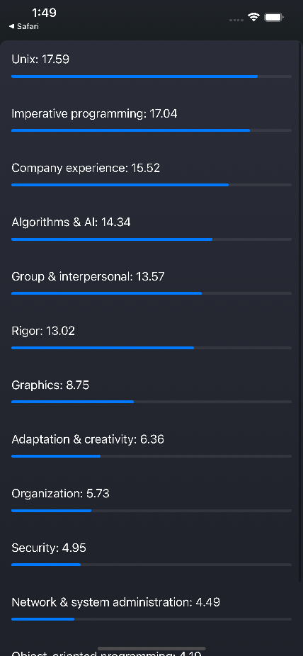
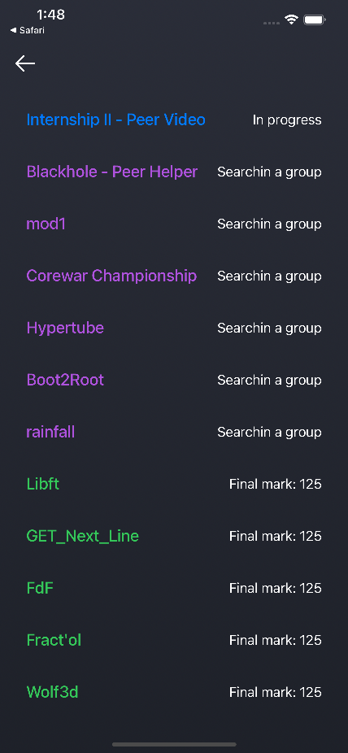

# SwiftyCompanion
An école 42 project, to build small app to use 42 API.

#### Main Features

- SwiftUI
- Async\await
- OAuth2.0 external lib
- RESTful Intra 42 API usage 

## Usage Example

## Screenshots

